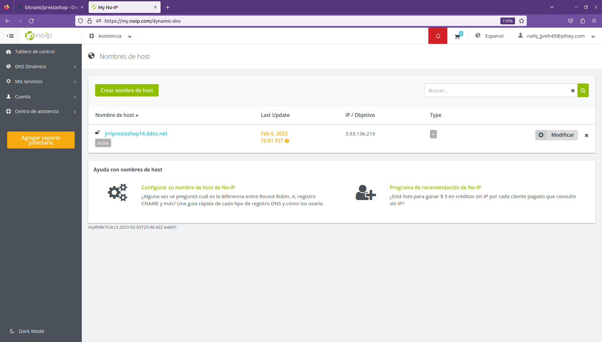
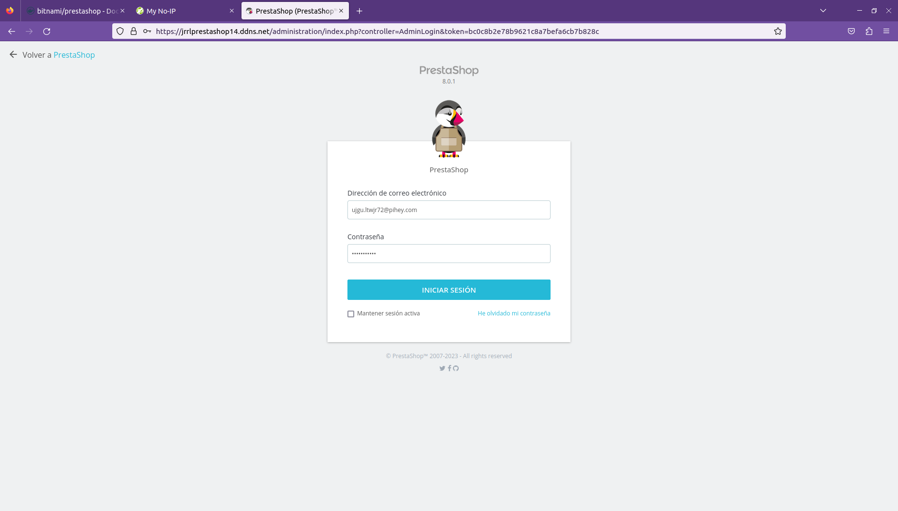
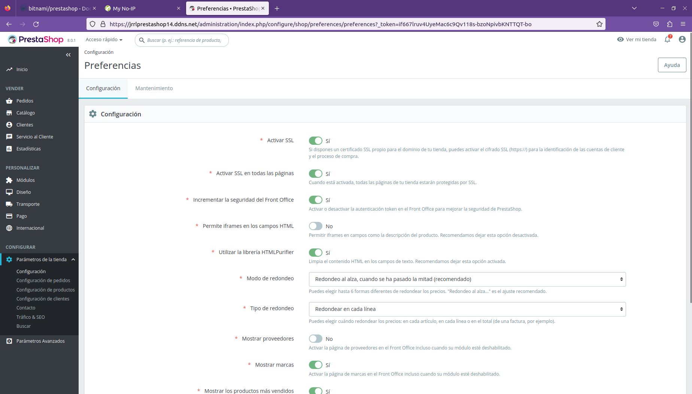
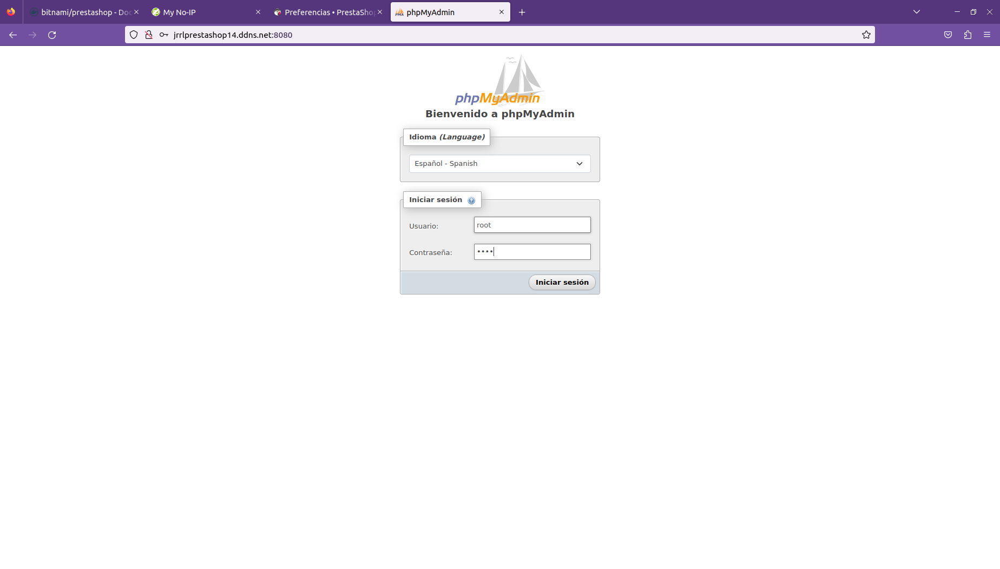
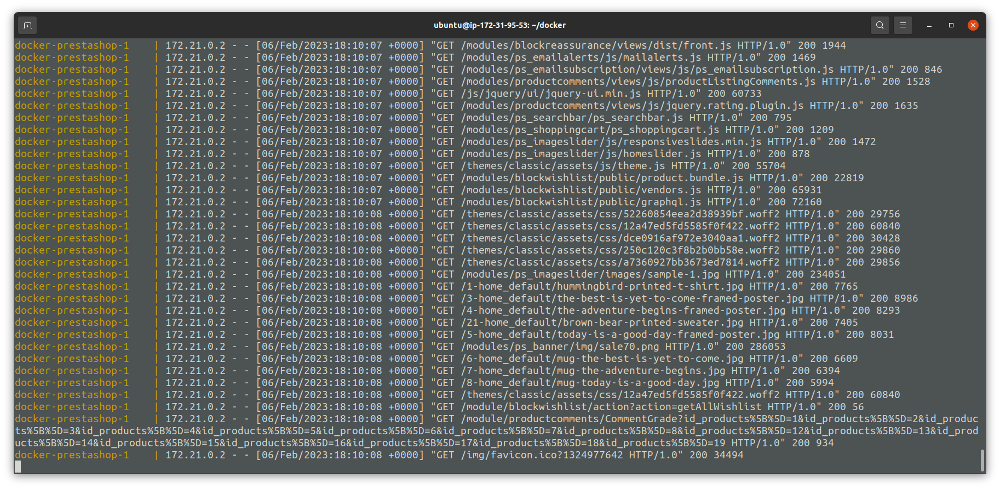

# iaw-practica-14.2

En esta práctica realizaremos la misma operación que en la práctica anterior, salvo por el contenedor que tenemos que usar, en vez de usar WordPress, usaremos PrestaShop y adición de más variables. **Puesto que de PrestaShop no hay una imagen oficial, usaremos bitnami/prestashop**. También ***asignaremos a la instancia al menos 8GB de memoria RAM*** para que PrestaShop se cree en poco tiempo.

Crearemos un repositorio :octocat: y lo clonaremos en nuestra máquina local, apenas hay cambios con respecto a la práctica anterior, por lo que usaremos casi todo el código de la anterior práctica para aprovechar el tiempo y realizar únicamente la parte del contenedor de PrestaShop.

La estructura del repositorio es la siguiente:

+ **ansible**
  + **inventario**
    + inventario

  + **playbooks**
    + delete_compose.yaml

    + deploy_compose.yaml

    + install_docker.yaml

  + **vars**
    + variables.yaml

  + main.yaml

+ **docker**
  + .env

  + docker-compose.yaml

+ **terraform**
  + main.tf

  + variables.tf

## docker

En esta parte tendremos lo mismo que en la anterior práctica, salvo por el cambio de WordPress a PrestaShop en el archivo de *docker-compose.yaml* y la agregación de variables al archivo *.env*, por lo que explicaré las adiciones en ambos archivos.

### .env

Antes de entrar con el archivo *docker-compose.yaml*, asignaremos las variables que hay que usar para PrestaShop.

La primera variable, *USER_FIRST_NAME*, nos permitirá establecer el nombre del propietario de la tienda de PrestaShop, con la segunda variable, *USER_LAST_NAME*, servirá para establecer los apellidos o el segundo nombre del propietario. Con la variable *PRESTASHOP_ACCESS_EMAIL* establecemos el correo electrónico que se usará en PrestaShop para el acceso al Back-Office, con la variable *PRESTASHOP_ACCESS_PASSWORD* estableceremos la contraseña de acceso al Back-Office.

La siguiente variable, *PRESTASHOP_DOMAIN*, nos servirá para indicar el nombre de dominio que tiene la tienda online, con *PRESTASHOP_COUNTRY* establecemos el país de la tienda y con *PRESTASHOP_LANGUAGE* establecemos el idioma para PrestaShop.

```
USER_FIRST_NAME="Juan Ramón"
USER_LAST_NAME="Rueda Lao"
PRESTASHOP_ACCESS_EMAIL=ujgu.ltwjr72@pihey.com
PRESTASHOP_ACCESS_PASSWORD=Admin123@45
PRESTASHOP_DOMAIN=jrrlprestashop14.ddns.net
PRESTASHOP_COUNTRY_LANGUAGE=es
```

### docker-compose.yaml

Comenzaremos directamente con el contenedor de PrestaShop, usaremos la imagen *bitnami/prestashop:8.0.1*, esta es la última versión, por lo que por buenas prácticas, no usaremos latest o dejaremos en blanco la versión ya que al subirse otra versión nueva de la imagen, nos puede dar fallos al implementarla. Esta imagen realiza la instalación de PrestaShop por defecto, por lo que usaremos las variables de entorno que necesitemos y queramos para personalizar el sitio web.

Con la variable de entorno *PRESTASHOP_FIRST_NAME* asignamos el nombre del propietario que hemos declarado en el archivo de variables, con la segunda variable, *PRESTASHOP_LAST_NAME* estableceremos la variable para los apellidos o el segundo nombre del usuario, con la tercera variable, *PRESTASHOP_EMAIL* asignaremos el email que se usará para el acceso al Back-Office y con *PRESTASHOP_PASSWORD* estableceremos la contraseña de acceso al Back-Office.

En la variable *PRESTASHOP_HOST*, pondremos la variable para el dominio de la tienda online, en la variable *PRESTASHOP_ENABLE_HTTPS=yes* estableceremos que la tienda use TLS / SSL para agregar seguridad. En *PRESTASHOP_COUNTRY* asignaremos la variable para establecer el país y en *PRESTASHOP_LANGUAGE* usaremos la variable para indicar el idioma de la tienda.

Para ir finalizando con las variables de entorno de PrestaShop, usaremos la variable *PRESTASHOP_DATABASE_HOST* para indicar el contenedor que tiene la base de datos, con la variable *PRESTASHOP_DATABASE_NAME* indicaremos la base de datos que se usará para crear las tablas y los registros, con *PRESTASHOP_DATABASE_USER* estableceremos el usuario de la base de datos y con *PRESTASHOP_DATABASE_PASSWORD* la contraseña del usuario de la base de datos.

A continuación, si no queremos evitar perder datos, hay que usar un volumen gestionado por Docker, en este caso la variable del volumen es **prestashop_data** y la tenemos que vincular al directorio **/bitnami/prestashop**, después, el contenedor esperará a que el contenedor mysql esté saludable para poder ejecutarse y con un *restart always* para que se reinicie en cuanto tenga algún fallo y por último, el contenedor estará conectado a las networks *frontend-network* y *backend-network* para poder servir su contenido y conectarse con el contenedor mysql.

```yaml
  prestashop:
    image: bitnami/prestashop:8.0.1
    # ports:
    #   - 80:80
    environment:
      - PRESTASHOP_FIRST_NAME=${USER_FIRST_NAME}
      - PRESTASHOP_LAST_NAME=${USER_LAST_NAME}
      - PRESTASHOP_EMAIL=${PRESTASHOP_ACCESS_EMAIL}
      - PRESTASHOP_PASSWORD=${PRESTASHOP_ACCESS_PASSWORD}
      - PRESTASHOP_HOST=${PRESTASHOP_DOMAIN}
      - PRESTASHOP_ENABLE_HTTPS=yes
      - PRESTASHOP_COUNTRY=${PRESTASHOP_COUNTRY_LANGUAGE}
      - PRESTASHOP_LANGUAGE=${PRESTASHOP_COUNTRY_LANGUAGE}
      - PRESTASHOP_DATABASE_HOST=mysql
      - PRESTASHOP_DATABASE_NAME=${MYSQL_DATABASE}
      - PRESTASHOP_DATABASE_USER=${MYSQL_USER}
      - PRESTASHOP_DATABASE_PASSWORD=${MYSQL_PASSWORD}
    volumes:
      - prestashop_data:/bitnami/prestashop
    depends_on:
      mysql:
        condition: service_healthy
    restart: always
    networks:
      - frontend-network
      - backend-network
```

Por defecto, esta imagen de PrestaShop usa el puerto 8080 de Apache, por lo que para conectar con el contenedor prestashop, hay que indicar el contenedor con el puerto 8080. También ***modificaremos el dominio de DOMAINS para que adecuarlo a la práctica***.

```yaml
  https-portal:
    image: steveltn/https-portal
    ports:
      - '80:80'
      - '443:443'
    volumes:
      - ssl_certs_data:/var/lib/https-portal
    environment:
      # DOMAINS: 'localhost -> http://prestashop:8080'
      # STAGE: 'local'
      DOMAINS: 'jrrlprestashop14.ddns.net -> http://prestashop:8080'
      STAGE: 'production'
    restart: always
    networks: 
      - frontend-network
```

## Proceso de trabajo

Como hicimos con la práctica anterior, ejecutaremos primero Terraform para montar la infraestructura en AWS y la IP elástica que nos devuelva, la pondremos en el archivo inventario de Ansible. Después ejecutaremos el archivo main.yaml con las dos primeras variables para instalar Docker, Docker Compose y pasar los archivos que hemos creado de Docker Compose, además de ejecutar la infraestructura con el segundo playbook.

```bash
ansible-playbook -i inventario/inventario main.yaml --extra-vars "instalar=docker desplegar=compose"
```

Usaremos la IP elástica de la instancia de AWS para asignar el dominio a la IP elástica en [No-IP](https://www.noip.com/es-MX/).



Cuando Ansible termine de ejecutar todos los playbooks que queríamos ejecutar, esperaremos un par de minutos a que la infraestructura de contenedores esté completamente lista y accederemos al dominio que hemos preparado. Si todo ha ido bien, tendrá que salir la tienda online montada.


Lo siguiente que haremos será acceder al Back-Office de nuestra tienda online, para ello, ***no podemos usar dominio/admin*** ya que no está disponible dicho directorio por tanto tenemos que acceder al volumen de Docker que hay en la instancia para saber con certeza el acceso al Back-Office. Nos conectaremos por SSH a la instancia y usaremos los comandos:

```bash
sudo -s

cd /var/lib/docker/volumes/docker_prestashop_data/_data

ls
```

Vemos que no hay un directorio *admin*, pero sí que hay un directorio *administration* que será el que probaremos junto al dominio.


Vemos que hemos podido acceder al login del Back-Office, lo siguiente es poner el email y la contraseña que hemos asignado en el archivo *docker-compose.yaml*.



Una vez hayamos accedido, iremos a *Parámetros de la tienda* ---> *Configuración* para comprobar que tenemos realmente activado el TLS / SSL en la tienda.



A continuación, usaremos abriremos una nueva pestaña y probaremos a acceder a phpMyAdmin. Tenemos que poner :point_right: *dominio:8080*.



Después, accederemos a la base de datos que hemos designado para PrestaShop y veremos que hay bastantes tablas creadas.


Por último, comprobaremos los logs de los contenedores, en el terminal de la instancia, saldremos de los privilegios de *ROOT* mediante el comando *exit*. Después, en el directorio en el que están los archivo de Docker Compose, usaremos el comando:

```bash
docker compose logs -f
```

Con *logs*, comprobamos el funcionamiento de la infraestructura y sus *"procesos"*, con *-f* hacemos que se quede constantemente en primer plano, sin que muestre todos los logs que hay y luego finalice la ejecución del comando. Probaremos a refrescar la tienda online y veremos que se generan nuevo contenido.


